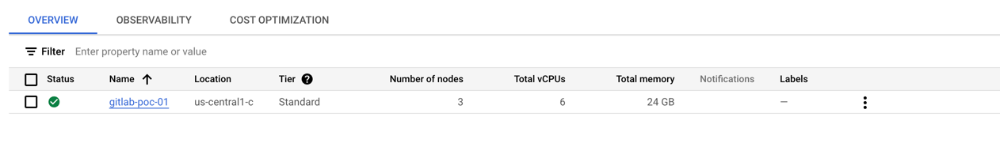
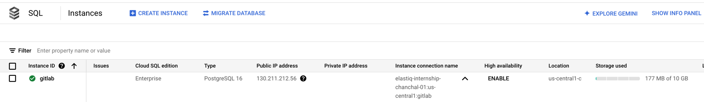
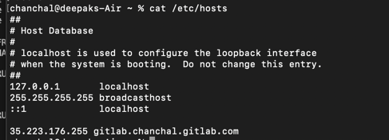
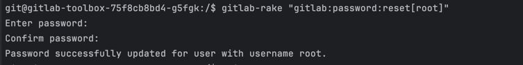
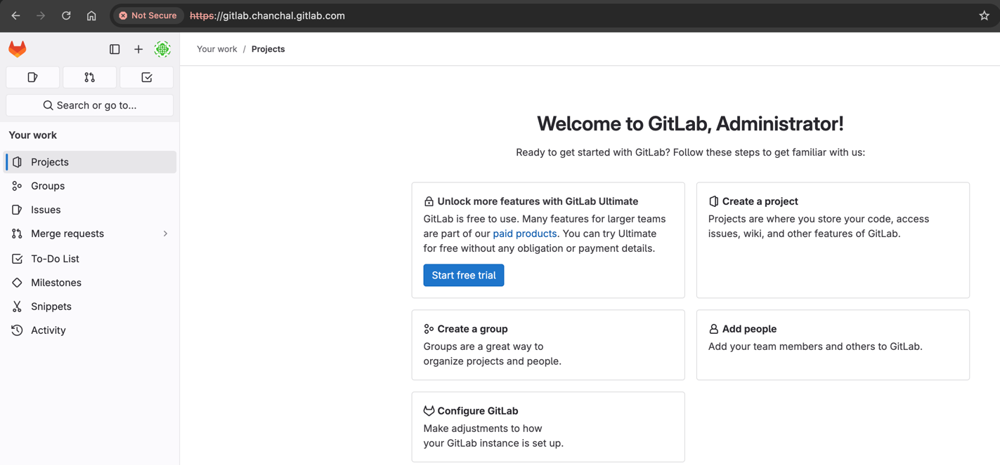
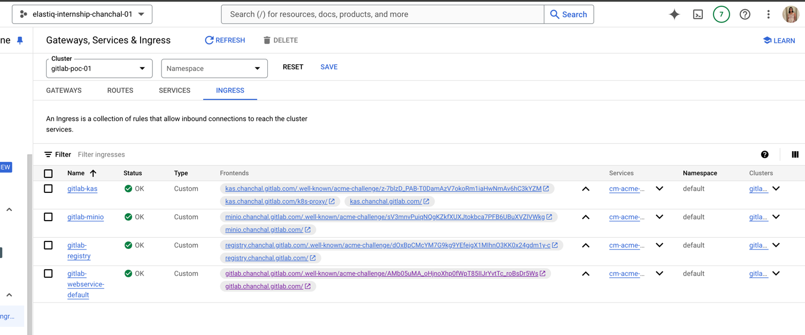

Deploying Gitlab on GKE


This document highlights the different configurations for gitlab deployment on GKE and recommended configuration based on user load.

As per gitlab cloud native reference architecture

Costing evaluating based on below reference architecture

GKE autopilot did not worked due to quota limit of free account

### Step#0 
We will be creating GKE with private nodes only, that means all the traffic to internet must go through Cloud NAT.
Create a cloud NAT with static public IP, we need to whitelist this Cloud NAT ip in the cloud SQL authorized networks,
so gitlab pods from GKE can reach to cloud sql db.

Create the Cloud NAT in same region and network as our GKE cluster will be.

### Step #1 Create Autopilot cluster

```bash

gcloud beta container clusters create "gitlab-poc-01" \
  --project "elastiq-internship-chanchal-01" \
  --zone "us-central1-c" \
  --tier "standard" \
  --no-enable-basic-auth --cluster-version "1.30.5-gke.1443001" \
  --release-channel "regular" \
  --machine-type "n2-standard-2" \
  --image-type "COS_CONTAINERD" \
  --disk-type "pd-balanced" \
  --disk-size "50" \
  --metadata disable-legacy-endpoints=true \
  --scopes "https://www.googleapis.com/auth/cloud-platform" \
  --num-nodes "3" \
  --logging=SYSTEM,WORKLOAD \
  --monitoring=SYSTEM,STORAGE,POD,DEPLOYMENT,STATEFULSET,DAEMONSET,HPA,CADVISOR,KUBELET \
  --enable-ip-alias \
  --enable-private-nodes \
  --network "projects/elastiq-internship-chanchal-01/global/networks/default" \
  --subnetwork "projects/elastiq-internship-chanchal-01/regions/us-central1/subnetworks/default" \
  --no-enable-intra-node-visibility \
  --default-max-pods-per-node "110" \
  --enable-ip-access \
  --security-posture=standard \
  --workload-vulnerability-scanning=disabled \
  --enable-master-authorized-networks \
  --master-authorized-networks 71.221.3.76/32 \
  --no-enable-google-cloud-access \
  --addons HorizontalPodAutoscaling,HttpLoadBalancing,GcePersistentDiskCsiDriver \
  --enable-autoupgrade \
  --enable-autorepair \
  --max-surge-upgrade 1 \
  --max-unavailable-upgrade 0 \
  --binauthz-evaluation-mode=DISABLED \
  --enable-managed-prometheus \
  --enable-shielded-nodes \
  --node-locations "us-central1-c"

```



## Step #2 Create Cloud SQL instance
```yaml
Configuration:
  PublicIp: 
  Password: 
  ConnectionName: elastiq-internship-chanchal-01:us-central1:gitlab
  Others: 
    vCPUs: 2
    Memory: "8GB"
    HDDStorage: "10GB"
  Version: "PostgreSQL 16.4"
  Metadata:
    - "No backup"
```


## Step #3 Create Memory Store Redis - Optional
```bash
gcloud redis instances create gitlab --tier=basic \
  --project=elastiq-internship-chanchal-01  \
  --size=2 \
  --region=us-central1 \
  --redis-version=redis_7_0 \
  --network=projects/elastiq-internship-chanchal-01/global/networks/default \
  --connect-mode=PRIVATE_SERVICE_ACCESS \
  --transit-encryption-mode=SERVER_AUTHENTICATION \
  --enable-auth
```


## Step #4 Connect to GKE Cluster

```bash
gcloud container clusters get-credentials gitlab-poc-01 --zone us-central1-c --project elastiq-internship-chanchal-01
```


## Step#5 Creating secret for external PostgresDB

1. Create password for postgressql
```
PASSWORD=password
kubectl create secret generic gitlab-postgress-password \
    --from-literal=postgresql-password=$PASSWORD
```

2. kubectl describe secret gitlab-postgresql-password 
```bash
kubectl get secret gitlab-postgress-password -o jsonpath='{.data}'

```


## Step#6 Deploy Gitlab using Helm Chart on GKE
Reference: https://docs.gitlab.com/charts/quickstart/index.html

Gitlab Helm chart configuation: https://docs.gitlab.com/charts/charts/globals.html
```bash
# Install helm
brew install helm


helm repo add gitlab https://charts.gitlab.io/

helm install -f values.yaml gitlab gitlab/gitlab
#helm upgrade -f values.yaml gitlab gitlab/gitlab
# helm uninstall gitlab

```

Get gitlab ingress ip address:
```bash
kubectl get ingress -lrelease=gitlab

```

Add a hostname entry in /etc/hosts file at local or add a A name record for the domain you name used for gitlab.


Get the gitlab admin login password. If initial password does not work, reset the root password using gitlab-rake cli

```bash
kubectl get secret gitlab-gitlab-initial-root-password -ojsonpath='{.data.password}' | base64 --decode ; echo

```

## Step#7 Access the gitlab endpoint at

```bash
open https://gitlab.chanchal.gitlab.com
```

## Reset Root user password

Gitlab comes with a command line gitlab-rake to perform administrative tasks. This gitlab-rake is installed in deployment gitlab-toolbox deployment.

Step to reset any user password
1. Find a pod in gitlab-toolbox deployment
```bash
kubectl get pods -l=app=toolbox

```
2. Exec into the pod
```bash
kubectl exec -it gitlab-toolbox-75f8cb8bd4-g5fgk -- bash
```

3. Reset the password.

Below command with reset the password for root user.
```bash
gitlab-rake "gitlab:password:reset[root]"
```





